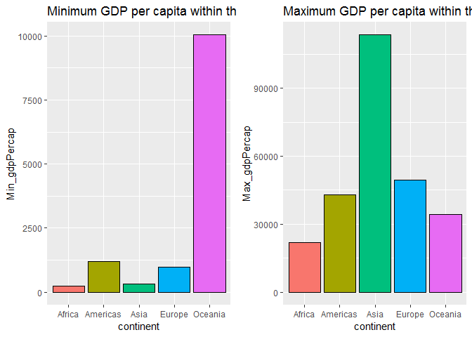
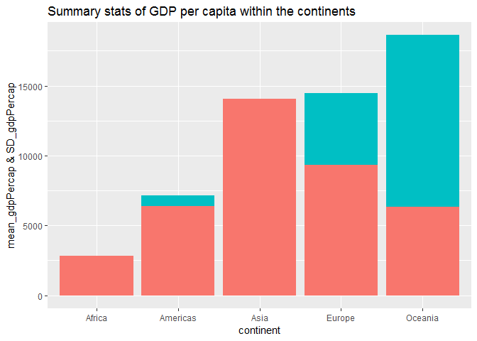
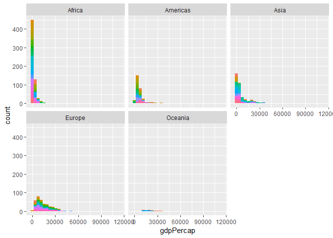
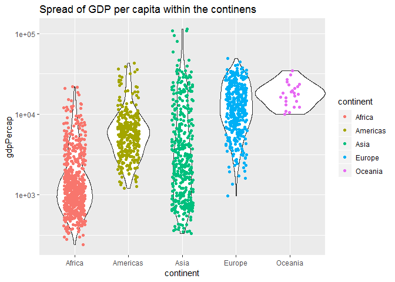
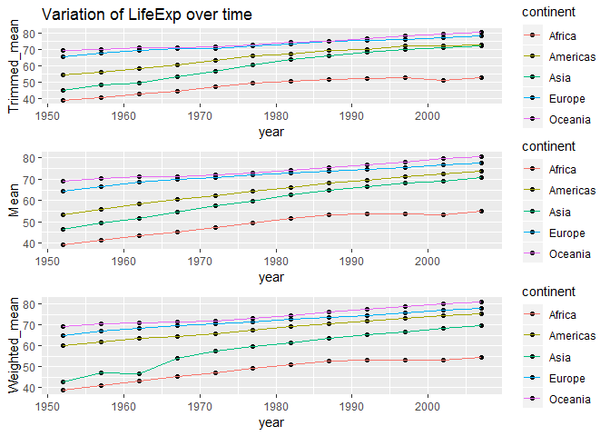
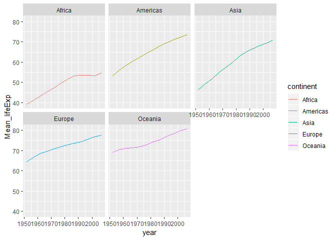

### Loading Data frame into R markdown

The following packages were loaded into Markdown:
1. Gapminder, which was used as the data frame for the assignment
2. Tidyverse, contains all the dpyr and ggplot2 functions
3. kableExtra
4. gridExtra


```r
library(gapminder)
library(tidyverse)
```

```
## -- Attaching packages -------------------------------------------------- tidyverse 1.2.1 --
```

```
## v ggplot2 3.0.0     v purrr   0.2.5
## v tibble  1.4.2     v dplyr   0.7.6
## v tidyr   0.8.1     v stringr 1.3.1
## v readr   1.1.1     v forcats 0.3.0
```

```
## -- Conflicts ----------------------------------------------------- tidyverse_conflicts() --
## x dplyr::filter() masks stats::filter()
## x dplyr::lag()    masks stats::lag()
```

```r
library(kableExtra)
library(gridExtra)
```

```
## 
## Attaching package: 'gridExtra'
```

```
## The following object is masked from 'package:dplyr':
## 
##     combine
```

### Task1: Max and Min GDP per capita for all continents

##### **Data Manipulation using dplyr**

The gapminder data frame was further grouped into a small data frame named `a`. `knitr::kable` was used to generate a table.


```r
a <- gapminder %>% # call data frame
  group_by(continent) %>% #group by continent
  summarise(min = min(gdpPercap),
         max = max(gdpPercap)) %>% # calculating max and min GDP per cap
  rename(Min_gdpPercap = min, Max_gdpPercap = max) 

kable(a, formart = "markdown") %>% 
kable_styling(bootstrap_options = c("striped")) # output in the form of table
```

<table class="table table-striped" style="margin-left: auto; margin-right: auto;">
 <thead>
  <tr>
   <th style="text-align:left;"> continent </th>
   <th style="text-align:right;"> Min_gdpPercap </th>
   <th style="text-align:right;"> Max_gdpPercap </th>
  </tr>
 </thead>
<tbody>
  <tr>
   <td style="text-align:left;"> Africa </td>
   <td style="text-align:right;"> 241.1659 </td>
   <td style="text-align:right;"> 21951.21 </td>
  </tr>
  <tr>
   <td style="text-align:left;"> Americas </td>
   <td style="text-align:right;"> 1201.6372 </td>
   <td style="text-align:right;"> 42951.65 </td>
  </tr>
  <tr>
   <td style="text-align:left;"> Asia </td>
   <td style="text-align:right;"> 331.0000 </td>
   <td style="text-align:right;"> 113523.13 </td>
  </tr>
  <tr>
   <td style="text-align:left;"> Europe </td>
   <td style="text-align:right;"> 973.5332 </td>
   <td style="text-align:right;"> 49357.19 </td>
  </tr>
  <tr>
   <td style="text-align:left;"> Oceania </td>
   <td style="text-align:right;"> 10039.5956 </td>
   <td style="text-align:right;"> 34435.37 </td>
  </tr>
</tbody>
</table>


The above output shows that Asia has the highest maximum gdpPercap while Africa has the lowest minimum gdpPercap. It can be visualised clearly using plots.

###### **Data Visualisation using ggplot**

Bar plots were used to visualise the data set obtained above.


```r
p1 <- ggplot(a, aes(continent, Min_gdpPercap, label = Min_gdpPercap)) +
  geom_bar(stat = 'identity', position = 'dodge', aes(fill =continent), color= "black", show.legend = FALSE)+
  labs(title = "Minimum GDP per capita within the continents") # barplot for continent vs min GDP

p2 <- ggplot(a, aes(continent, Max_gdpPercap, label = Max_gdpPercap)) +
  geom_bar(stat = 'identity', position = 'dodge', aes(fill =continent), color= "black", show.legend = FALSE)+
  labs(title = "Maximum GDP per capita within the continents") #barplot of continent vs Max GDP

grid.arrange(p1, p2, ncol=2) #arrange two plots side by side
```

<!-- -->


The `first graph` shows that Oceania has the highest minimum GDP per capita and Africa has the lowest. The `second graph` shows that Asia has the highest maximum GDP per capita and Africa has the lowest. 

Overall, Africa has the lowest GDP per capita of all continents and Oceania has the highest.

### Task2: Spread of GDP per capita within continents


##### **Data Manipulation using dplyr**


Firstly, summary stats fucntions were used to have an idea about the spread of GDP per capita for each continent. The table bellow gives the mean and standard deviation within the continents.


```r
b <- gapminder %>% #call data frame
  group_by(continent) %>% #group by continent
  summarise(mean_gdpPercap = mean(gdpPercap),
            SD_gdpPercap = sd(gdpPercap)) #obtain the spread of gdp per capita
kable(b, formart = "markdown") %>% 
  kable_styling(bootstrap_options = c("striped")) #output in the form of table
```

<table class="table table-striped" style="margin-left: auto; margin-right: auto;">
 <thead>
  <tr>
   <th style="text-align:left;"> continent </th>
   <th style="text-align:right;"> mean_gdpPercap </th>
   <th style="text-align:right;"> SD_gdpPercap </th>
  </tr>
 </thead>
<tbody>
  <tr>
   <td style="text-align:left;"> Africa </td>
   <td style="text-align:right;"> 2193.755 </td>
   <td style="text-align:right;"> 2827.930 </td>
  </tr>
  <tr>
   <td style="text-align:left;"> Americas </td>
   <td style="text-align:right;"> 7136.110 </td>
   <td style="text-align:right;"> 6396.764 </td>
  </tr>
  <tr>
   <td style="text-align:left;"> Asia </td>
   <td style="text-align:right;"> 7902.150 </td>
   <td style="text-align:right;"> 14045.373 </td>
  </tr>
  <tr>
   <td style="text-align:left;"> Europe </td>
   <td style="text-align:right;"> 14469.476 </td>
   <td style="text-align:right;"> 9355.213 </td>
  </tr>
  <tr>
   <td style="text-align:left;"> Oceania </td>
   <td style="text-align:right;"> 18621.609 </td>
   <td style="text-align:right;"> 6358.983 </td>
  </tr>
</tbody>
</table>


##### **Data Visualisation using ggplot**


```r
ggplot(b) +
  geom_bar(aes(continent, mean_gdpPercap, fill = "red"), stat = 'identity', position = 'dodge', show.legend = FALSE) +
  geom_bar(aes(continent, SD_gdpPercap, fill = "blue"), stat = 'identity', position = 'dodge', show.legend = FALSE)+
  ylab("mean_gdpPercap & SD_gdpPercap")+
  labs(title = "Summary stats of GDP per capita within the continents") #visualising the table obtained above in the form of bar plots
```

<!-- -->


In the above plot, the `red` bars are for `mean GDP per capita` and `blue` bars for `standard deviation`.


##### **Alternative method for data visualidation**

`Facet` was used to have a clear picture of the spread of GDP per capita within the continents. 


```r
gapminder %>% #call data frame
  ggplot(aes(gdpPercap)) +
  facet_wrap(~continent) +
  geom_histogram(aes(fill=country), show.legend = FALSE) #facet plot
```

```
## `stat_bin()` using `bins = 30`. Pick better value with `binwidth`.
```

<!-- -->


It is clear from the above output that GDP per capita for Oceania varies the least while Africa has the maximum variation.

The point made above was also justified using the plot below which proves the statement made above.


```r
gapminder %>% 
  ggplot(aes(continent, gdpPercap)) +
  scale_y_log10() +
  geom_violin(width = 1.30) + 
  geom_jitter(aes(color = continent), width = 0.2)+
  labs(title = "Spread of GDP per capita within the continens") #title of the plot
```

```
## Warning: position_dodge requires non-overlapping x intervals
```

<!-- -->


### Task3: Summary Stat of lifeExp variable of the Data frame


##### **Data Manipulation using dplyr**


For this task, `Trimmed Mean` (with trim factor of 50%) and `Weighted Mean` were compared to the actual mean of lifeExp for each continent.


```r
d <- gapminder %>% 
  group_by(continent, year) %>% 
  summarise(Trimmed_mean = mean(lifeExp, trim=0.5),
            median = median(lifeExp),
            Mean = mean(lifeExp),
            Weighted_mean = weighted.mean(lifeExp,pop)) #trimmed, weighted and avg mean

kable(d, formart = "markdown") %>% 
kable_styling(bootstrap_options = c("striped")) #output in the form of table
```

<table class="table table-striped" style="margin-left: auto; margin-right: auto;">
 <thead>
  <tr>
   <th style="text-align:left;"> continent </th>
   <th style="text-align:right;"> year </th>
   <th style="text-align:right;"> Trimmed_mean </th>
   <th style="text-align:right;"> median </th>
   <th style="text-align:right;"> Mean </th>
   <th style="text-align:right;"> Weighted_mean </th>
  </tr>
 </thead>
<tbody>
  <tr>
   <td style="text-align:left;"> Africa </td>
   <td style="text-align:right;"> 1952 </td>
   <td style="text-align:right;"> 38.8330 </td>
   <td style="text-align:right;"> 38.8330 </td>
   <td style="text-align:right;"> 39.13550 </td>
   <td style="text-align:right;"> 38.79973 </td>
  </tr>
  <tr>
   <td style="text-align:left;"> Africa </td>
   <td style="text-align:right;"> 1957 </td>
   <td style="text-align:right;"> 40.5925 </td>
   <td style="text-align:right;"> 40.5925 </td>
   <td style="text-align:right;"> 41.26635 </td>
   <td style="text-align:right;"> 40.94031 </td>
  </tr>
  <tr>
   <td style="text-align:left;"> Africa </td>
   <td style="text-align:right;"> 1962 </td>
   <td style="text-align:right;"> 42.6305 </td>
   <td style="text-align:right;"> 42.6305 </td>
   <td style="text-align:right;"> 43.31944 </td>
   <td style="text-align:right;"> 43.09925 </td>
  </tr>
  <tr>
   <td style="text-align:left;"> Africa </td>
   <td style="text-align:right;"> 1967 </td>
   <td style="text-align:right;"> 44.6985 </td>
   <td style="text-align:right;"> 44.6985 </td>
   <td style="text-align:right;"> 45.33454 </td>
   <td style="text-align:right;"> 45.17721 </td>
  </tr>
  <tr>
   <td style="text-align:left;"> Africa </td>
   <td style="text-align:right;"> 1972 </td>
   <td style="text-align:right;"> 47.0315 </td>
   <td style="text-align:right;"> 47.0315 </td>
   <td style="text-align:right;"> 47.45094 </td>
   <td style="text-align:right;"> 47.21229 </td>
  </tr>
  <tr>
   <td style="text-align:left;"> Africa </td>
   <td style="text-align:right;"> 1977 </td>
   <td style="text-align:right;"> 49.2725 </td>
   <td style="text-align:right;"> 49.2725 </td>
   <td style="text-align:right;"> 49.58042 </td>
   <td style="text-align:right;"> 49.20883 </td>
  </tr>
  <tr>
   <td style="text-align:left;"> Africa </td>
   <td style="text-align:right;"> 1982 </td>
   <td style="text-align:right;"> 50.7560 </td>
   <td style="text-align:right;"> 50.7560 </td>
   <td style="text-align:right;"> 51.59287 </td>
   <td style="text-align:right;"> 51.01744 </td>
  </tr>
  <tr>
   <td style="text-align:left;"> Africa </td>
   <td style="text-align:right;"> 1987 </td>
   <td style="text-align:right;"> 51.6395 </td>
   <td style="text-align:right;"> 51.6395 </td>
   <td style="text-align:right;"> 53.34479 </td>
   <td style="text-align:right;"> 52.82479 </td>
  </tr>
  <tr>
   <td style="text-align:left;"> Africa </td>
   <td style="text-align:right;"> 1992 </td>
   <td style="text-align:right;"> 52.4290 </td>
   <td style="text-align:right;"> 52.4290 </td>
   <td style="text-align:right;"> 53.62958 </td>
   <td style="text-align:right;"> 53.37292 </td>
  </tr>
  <tr>
   <td style="text-align:left;"> Africa </td>
   <td style="text-align:right;"> 1997 </td>
   <td style="text-align:right;"> 52.7590 </td>
   <td style="text-align:right;"> 52.7590 </td>
   <td style="text-align:right;"> 53.59827 </td>
   <td style="text-align:right;"> 53.28327 </td>
  </tr>
  <tr>
   <td style="text-align:left;"> Africa </td>
   <td style="text-align:right;"> 2002 </td>
   <td style="text-align:right;"> 51.2355 </td>
   <td style="text-align:right;"> 51.2355 </td>
   <td style="text-align:right;"> 53.32523 </td>
   <td style="text-align:right;"> 53.30314 </td>
  </tr>
  <tr>
   <td style="text-align:left;"> Africa </td>
   <td style="text-align:right;"> 2007 </td>
   <td style="text-align:right;"> 52.9265 </td>
   <td style="text-align:right;"> 52.9265 </td>
   <td style="text-align:right;"> 54.80604 </td>
   <td style="text-align:right;"> 54.56441 </td>
  </tr>
  <tr>
   <td style="text-align:left;"> Americas </td>
   <td style="text-align:right;"> 1952 </td>
   <td style="text-align:right;"> 54.7450 </td>
   <td style="text-align:right;"> 54.7450 </td>
   <td style="text-align:right;"> 53.27984 </td>
   <td style="text-align:right;"> 60.23599 </td>
  </tr>
  <tr>
   <td style="text-align:left;"> Americas </td>
   <td style="text-align:right;"> 1957 </td>
   <td style="text-align:right;"> 56.0740 </td>
   <td style="text-align:right;"> 56.0740 </td>
   <td style="text-align:right;"> 55.96028 </td>
   <td style="text-align:right;"> 62.01806 </td>
  </tr>
  <tr>
   <td style="text-align:left;"> Americas </td>
   <td style="text-align:right;"> 1962 </td>
   <td style="text-align:right;"> 58.2990 </td>
   <td style="text-align:right;"> 58.2990 </td>
   <td style="text-align:right;"> 58.39876 </td>
   <td style="text-align:right;"> 63.43706 </td>
  </tr>
  <tr>
   <td style="text-align:left;"> Americas </td>
   <td style="text-align:right;"> 1967 </td>
   <td style="text-align:right;"> 60.5230 </td>
   <td style="text-align:right;"> 60.5230 </td>
   <td style="text-align:right;"> 60.41092 </td>
   <td style="text-align:right;"> 64.50630 </td>
  </tr>
  <tr>
   <td style="text-align:left;"> Americas </td>
   <td style="text-align:right;"> 1972 </td>
   <td style="text-align:right;"> 63.4410 </td>
   <td style="text-align:right;"> 63.4410 </td>
   <td style="text-align:right;"> 62.39492 </td>
   <td style="text-align:right;"> 65.70490 </td>
  </tr>
  <tr>
   <td style="text-align:left;"> Americas </td>
   <td style="text-align:right;"> 1977 </td>
   <td style="text-align:right;"> 66.3530 </td>
   <td style="text-align:right;"> 66.3530 </td>
   <td style="text-align:right;"> 64.39156 </td>
   <td style="text-align:right;"> 67.60591 </td>
  </tr>
  <tr>
   <td style="text-align:left;"> Americas </td>
   <td style="text-align:right;"> 1982 </td>
   <td style="text-align:right;"> 67.4050 </td>
   <td style="text-align:right;"> 67.4050 </td>
   <td style="text-align:right;"> 66.22884 </td>
   <td style="text-align:right;"> 69.19264 </td>
  </tr>
  <tr>
   <td style="text-align:left;"> Americas </td>
   <td style="text-align:right;"> 1987 </td>
   <td style="text-align:right;"> 69.4980 </td>
   <td style="text-align:right;"> 69.4980 </td>
   <td style="text-align:right;"> 68.09072 </td>
   <td style="text-align:right;"> 70.35814 </td>
  </tr>
  <tr>
   <td style="text-align:left;"> Americas </td>
   <td style="text-align:right;"> 1992 </td>
   <td style="text-align:right;"> 69.8620 </td>
   <td style="text-align:right;"> 69.8620 </td>
   <td style="text-align:right;"> 69.56836 </td>
   <td style="text-align:right;"> 71.72177 </td>
  </tr>
  <tr>
   <td style="text-align:left;"> Americas </td>
   <td style="text-align:right;"> 1997 </td>
   <td style="text-align:right;"> 72.1460 </td>
   <td style="text-align:right;"> 72.1460 </td>
   <td style="text-align:right;"> 71.15048 </td>
   <td style="text-align:right;"> 73.19154 </td>
  </tr>
  <tr>
   <td style="text-align:left;"> Americas </td>
   <td style="text-align:right;"> 2002 </td>
   <td style="text-align:right;"> 72.0470 </td>
   <td style="text-align:right;"> 72.0470 </td>
   <td style="text-align:right;"> 72.42204 </td>
   <td style="text-align:right;"> 74.24736 </td>
  </tr>
  <tr>
   <td style="text-align:left;"> Americas </td>
   <td style="text-align:right;"> 2007 </td>
   <td style="text-align:right;"> 72.8990 </td>
   <td style="text-align:right;"> 72.8990 </td>
   <td style="text-align:right;"> 73.60812 </td>
   <td style="text-align:right;"> 75.35668 </td>
  </tr>
  <tr>
   <td style="text-align:left;"> Asia </td>
   <td style="text-align:right;"> 1952 </td>
   <td style="text-align:right;"> 44.8690 </td>
   <td style="text-align:right;"> 44.8690 </td>
   <td style="text-align:right;"> 46.31439 </td>
   <td style="text-align:right;"> 42.94114 </td>
  </tr>
  <tr>
   <td style="text-align:left;"> Asia </td>
   <td style="text-align:right;"> 1957 </td>
   <td style="text-align:right;"> 48.2840 </td>
   <td style="text-align:right;"> 48.2840 </td>
   <td style="text-align:right;"> 49.31854 </td>
   <td style="text-align:right;"> 47.28835 </td>
  </tr>
  <tr>
   <td style="text-align:left;"> Asia </td>
   <td style="text-align:right;"> 1962 </td>
   <td style="text-align:right;"> 49.3250 </td>
   <td style="text-align:right;"> 49.3250 </td>
   <td style="text-align:right;"> 51.56322 </td>
   <td style="text-align:right;"> 46.57369 </td>
  </tr>
  <tr>
   <td style="text-align:left;"> Asia </td>
   <td style="text-align:right;"> 1967 </td>
   <td style="text-align:right;"> 53.6550 </td>
   <td style="text-align:right;"> 53.6550 </td>
   <td style="text-align:right;"> 54.66364 </td>
   <td style="text-align:right;"> 53.88261 </td>
  </tr>
  <tr>
   <td style="text-align:left;"> Asia </td>
   <td style="text-align:right;"> 1972 </td>
   <td style="text-align:right;"> 56.9500 </td>
   <td style="text-align:right;"> 56.9500 </td>
   <td style="text-align:right;"> 57.31927 </td>
   <td style="text-align:right;"> 57.52159 </td>
  </tr>
  <tr>
   <td style="text-align:left;"> Asia </td>
   <td style="text-align:right;"> 1977 </td>
   <td style="text-align:right;"> 60.7650 </td>
   <td style="text-align:right;"> 60.7650 </td>
   <td style="text-align:right;"> 59.61056 </td>
   <td style="text-align:right;"> 59.55648 </td>
  </tr>
  <tr>
   <td style="text-align:left;"> Asia </td>
   <td style="text-align:right;"> 1982 </td>
   <td style="text-align:right;"> 63.7390 </td>
   <td style="text-align:right;"> 63.7390 </td>
   <td style="text-align:right;"> 62.61794 </td>
   <td style="text-align:right;"> 61.57472 </td>
  </tr>
  <tr>
   <td style="text-align:left;"> Asia </td>
   <td style="text-align:right;"> 1987 </td>
   <td style="text-align:right;"> 66.2950 </td>
   <td style="text-align:right;"> 66.2950 </td>
   <td style="text-align:right;"> 64.85118 </td>
   <td style="text-align:right;"> 63.53710 </td>
  </tr>
  <tr>
   <td style="text-align:left;"> Asia </td>
   <td style="text-align:right;"> 1992 </td>
   <td style="text-align:right;"> 68.6900 </td>
   <td style="text-align:right;"> 68.6900 </td>
   <td style="text-align:right;"> 66.53721 </td>
   <td style="text-align:right;"> 65.14874 </td>
  </tr>
  <tr>
   <td style="text-align:left;"> Asia </td>
   <td style="text-align:right;"> 1997 </td>
   <td style="text-align:right;"> 70.2650 </td>
   <td style="text-align:right;"> 70.2650 </td>
   <td style="text-align:right;"> 68.02052 </td>
   <td style="text-align:right;"> 66.77092 </td>
  </tr>
  <tr>
   <td style="text-align:left;"> Asia </td>
   <td style="text-align:right;"> 2002 </td>
   <td style="text-align:right;"> 71.0280 </td>
   <td style="text-align:right;"> 71.0280 </td>
   <td style="text-align:right;"> 69.23388 </td>
   <td style="text-align:right;"> 68.13732 </td>
  </tr>
  <tr>
   <td style="text-align:left;"> Asia </td>
   <td style="text-align:right;"> 2007 </td>
   <td style="text-align:right;"> 72.3960 </td>
   <td style="text-align:right;"> 72.3960 </td>
   <td style="text-align:right;"> 70.72848 </td>
   <td style="text-align:right;"> 69.44386 </td>
  </tr>
  <tr>
   <td style="text-align:left;"> Europe </td>
   <td style="text-align:right;"> 1952 </td>
   <td style="text-align:right;"> 65.9000 </td>
   <td style="text-align:right;"> 65.9000 </td>
   <td style="text-align:right;"> 64.40850 </td>
   <td style="text-align:right;"> 64.90540 </td>
  </tr>
  <tr>
   <td style="text-align:left;"> Europe </td>
   <td style="text-align:right;"> 1957 </td>
   <td style="text-align:right;"> 67.6500 </td>
   <td style="text-align:right;"> 67.6500 </td>
   <td style="text-align:right;"> 66.70307 </td>
   <td style="text-align:right;"> 66.89364 </td>
  </tr>
  <tr>
   <td style="text-align:left;"> Europe </td>
   <td style="text-align:right;"> 1962 </td>
   <td style="text-align:right;"> 69.5250 </td>
   <td style="text-align:right;"> 69.5250 </td>
   <td style="text-align:right;"> 68.53923 </td>
   <td style="text-align:right;"> 68.45957 </td>
  </tr>
  <tr>
   <td style="text-align:left;"> Europe </td>
   <td style="text-align:right;"> 1967 </td>
   <td style="text-align:right;"> 70.6100 </td>
   <td style="text-align:right;"> 70.6100 </td>
   <td style="text-align:right;"> 69.73760 </td>
   <td style="text-align:right;"> 69.54963 </td>
  </tr>
  <tr>
   <td style="text-align:left;"> Europe </td>
   <td style="text-align:right;"> 1972 </td>
   <td style="text-align:right;"> 70.8850 </td>
   <td style="text-align:right;"> 70.8850 </td>
   <td style="text-align:right;"> 70.77503 </td>
   <td style="text-align:right;"> 70.46884 </td>
  </tr>
  <tr>
   <td style="text-align:left;"> Europe </td>
   <td style="text-align:right;"> 1977 </td>
   <td style="text-align:right;"> 72.3350 </td>
   <td style="text-align:right;"> 72.3350 </td>
   <td style="text-align:right;"> 71.93777 </td>
   <td style="text-align:right;"> 71.53989 </td>
  </tr>
  <tr>
   <td style="text-align:left;"> Europe </td>
   <td style="text-align:right;"> 1982 </td>
   <td style="text-align:right;"> 73.4900 </td>
   <td style="text-align:right;"> 73.4900 </td>
   <td style="text-align:right;"> 72.80640 </td>
   <td style="text-align:right;"> 72.56247 </td>
  </tr>
  <tr>
   <td style="text-align:left;"> Europe </td>
   <td style="text-align:right;"> 1987 </td>
   <td style="text-align:right;"> 74.8150 </td>
   <td style="text-align:right;"> 74.8150 </td>
   <td style="text-align:right;"> 73.64217 </td>
   <td style="text-align:right;"> 73.44717 </td>
  </tr>
  <tr>
   <td style="text-align:left;"> Europe </td>
   <td style="text-align:right;"> 1992 </td>
   <td style="text-align:right;"> 75.4510 </td>
   <td style="text-align:right;"> 75.4510 </td>
   <td style="text-align:right;"> 74.44010 </td>
   <td style="text-align:right;"> 74.44273 </td>
  </tr>
  <tr>
   <td style="text-align:left;"> Europe </td>
   <td style="text-align:right;"> 1997 </td>
   <td style="text-align:right;"> 76.1160 </td>
   <td style="text-align:right;"> 76.1160 </td>
   <td style="text-align:right;"> 75.50517 </td>
   <td style="text-align:right;"> 75.70849 </td>
  </tr>
  <tr>
   <td style="text-align:left;"> Europe </td>
   <td style="text-align:right;"> 2002 </td>
   <td style="text-align:right;"> 77.5365 </td>
   <td style="text-align:right;"> 77.5365 </td>
   <td style="text-align:right;"> 76.70060 </td>
   <td style="text-align:right;"> 77.02232 </td>
  </tr>
  <tr>
   <td style="text-align:left;"> Europe </td>
   <td style="text-align:right;"> 2007 </td>
   <td style="text-align:right;"> 78.6085 </td>
   <td style="text-align:right;"> 78.6085 </td>
   <td style="text-align:right;"> 77.64860 </td>
   <td style="text-align:right;"> 77.89057 </td>
  </tr>
  <tr>
   <td style="text-align:left;"> Oceania </td>
   <td style="text-align:right;"> 1952 </td>
   <td style="text-align:right;"> 69.2550 </td>
   <td style="text-align:right;"> 69.2550 </td>
   <td style="text-align:right;"> 69.25500 </td>
   <td style="text-align:right;"> 69.17040 </td>
  </tr>
  <tr>
   <td style="text-align:left;"> Oceania </td>
   <td style="text-align:right;"> 1957 </td>
   <td style="text-align:right;"> 70.2950 </td>
   <td style="text-align:right;"> 70.2950 </td>
   <td style="text-align:right;"> 70.29500 </td>
   <td style="text-align:right;"> 70.31693 </td>
  </tr>
  <tr>
   <td style="text-align:left;"> Oceania </td>
   <td style="text-align:right;"> 1962 </td>
   <td style="text-align:right;"> 71.0850 </td>
   <td style="text-align:right;"> 71.0850 </td>
   <td style="text-align:right;"> 71.08500 </td>
   <td style="text-align:right;"> 70.98808 </td>
  </tr>
  <tr>
   <td style="text-align:left;"> Oceania </td>
   <td style="text-align:right;"> 1967 </td>
   <td style="text-align:right;"> 71.3100 </td>
   <td style="text-align:right;"> 71.3100 </td>
   <td style="text-align:right;"> 71.31000 </td>
   <td style="text-align:right;"> 71.17848 </td>
  </tr>
  <tr>
   <td style="text-align:left;"> Oceania </td>
   <td style="text-align:right;"> 1972 </td>
   <td style="text-align:right;"> 71.9100 </td>
   <td style="text-align:right;"> 71.9100 </td>
   <td style="text-align:right;"> 71.91000 </td>
   <td style="text-align:right;"> 71.92273 </td>
  </tr>
  <tr>
   <td style="text-align:left;"> Oceania </td>
   <td style="text-align:right;"> 1977 </td>
   <td style="text-align:right;"> 72.8550 </td>
   <td style="text-align:right;"> 72.8550 </td>
   <td style="text-align:right;"> 72.85500 </td>
   <td style="text-align:right;"> 73.25684 </td>
  </tr>
  <tr>
   <td style="text-align:left;"> Oceania </td>
   <td style="text-align:right;"> 1982 </td>
   <td style="text-align:right;"> 74.2900 </td>
   <td style="text-align:right;"> 74.2900 </td>
   <td style="text-align:right;"> 74.29000 </td>
   <td style="text-align:right;"> 74.58291 </td>
  </tr>
  <tr>
   <td style="text-align:left;"> Oceania </td>
   <td style="text-align:right;"> 1987 </td>
   <td style="text-align:right;"> 75.3200 </td>
   <td style="text-align:right;"> 75.3200 </td>
   <td style="text-align:right;"> 75.32000 </td>
   <td style="text-align:right;"> 75.98107 </td>
  </tr>
  <tr>
   <td style="text-align:left;"> Oceania </td>
   <td style="text-align:right;"> 1992 </td>
   <td style="text-align:right;"> 76.9450 </td>
   <td style="text-align:right;"> 76.9450 </td>
   <td style="text-align:right;"> 76.94500 </td>
   <td style="text-align:right;"> 77.35788 </td>
  </tr>
  <tr>
   <td style="text-align:left;"> Oceania </td>
   <td style="text-align:right;"> 1997 </td>
   <td style="text-align:right;"> 78.1900 </td>
   <td style="text-align:right;"> 78.1900 </td>
   <td style="text-align:right;"> 78.19000 </td>
   <td style="text-align:right;"> 78.61843 </td>
  </tr>
  <tr>
   <td style="text-align:left;"> Oceania </td>
   <td style="text-align:right;"> 2002 </td>
   <td style="text-align:right;"> 79.7400 </td>
   <td style="text-align:right;"> 79.7400 </td>
   <td style="text-align:right;"> 79.74000 </td>
   <td style="text-align:right;"> 80.16006 </td>
  </tr>
  <tr>
   <td style="text-align:left;"> Oceania </td>
   <td style="text-align:right;"> 2007 </td>
   <td style="text-align:right;"> 80.7195 </td>
   <td style="text-align:right;"> 80.7195 </td>
   <td style="text-align:right;"> 80.71950 </td>
   <td style="text-align:right;"> 81.06215 </td>
  </tr>
</tbody>
</table>


One interesting observation was made here. The `Trimmed Mean` and the `Median` for each continent are exactly the same which means that if we trim the data by 50% from both sides then it gives us the `Median`.


##### **Data Visualisation using ggplot**

The following graphs compares the three types of mean for each continent.


```r
g1 <- ggplot(d) +
  geom_point(aes(year, Trimmed_mean, fill = continent)) +
  geom_line(aes(year, Trimmed_mean, color = continent))+
  labs(title = "Variation of LifeExp over time")

g2 <- ggplot(d) +
  geom_point(aes(year, Mean, fill = continent)) +
  geom_line(aes(year, Mean, color = continent))

g3 <- ggplot(d) +
  geom_point(aes(year, Weighted_mean, fill = continent)) +
  geom_line(aes(year, Weighted_mean, color = continent))

grid.arrange(g1, g2, g3, nrow=3)
```

<!-- -->


An **important obseration** made here is that, `mean lifeExp` of Oceania was always high in all the three cases. It also proves the fact that `GDP per capita` and `lifeExp` have a `positive relation` as obtained from the output of Task2 that the mean GDP per capita of Oceania was the highest.


# Task4: LifeExp changing over time for different continents


##### **Data Manipulation using dplyr**

The average life expectancy was obtained using dplyr for each continent over the years and the output obtained was presented below.


```r
e <- gapminder %>% 
  group_by(continent, year) %>% 
  summarise(Mean_lifeExp = mean(lifeExp))
kable(e, formart = "markdown") %>% 
kable_styling(bootstrap_options = c("striped"))
```

<table class="table table-striped" style="margin-left: auto; margin-right: auto;">
 <thead>
  <tr>
   <th style="text-align:left;"> continent </th>
   <th style="text-align:right;"> year </th>
   <th style="text-align:right;"> Mean_lifeExp </th>
  </tr>
 </thead>
<tbody>
  <tr>
   <td style="text-align:left;"> Africa </td>
   <td style="text-align:right;"> 1952 </td>
   <td style="text-align:right;"> 39.13550 </td>
  </tr>
  <tr>
   <td style="text-align:left;"> Africa </td>
   <td style="text-align:right;"> 1957 </td>
   <td style="text-align:right;"> 41.26635 </td>
  </tr>
  <tr>
   <td style="text-align:left;"> Africa </td>
   <td style="text-align:right;"> 1962 </td>
   <td style="text-align:right;"> 43.31944 </td>
  </tr>
  <tr>
   <td style="text-align:left;"> Africa </td>
   <td style="text-align:right;"> 1967 </td>
   <td style="text-align:right;"> 45.33454 </td>
  </tr>
  <tr>
   <td style="text-align:left;"> Africa </td>
   <td style="text-align:right;"> 1972 </td>
   <td style="text-align:right;"> 47.45094 </td>
  </tr>
  <tr>
   <td style="text-align:left;"> Africa </td>
   <td style="text-align:right;"> 1977 </td>
   <td style="text-align:right;"> 49.58042 </td>
  </tr>
  <tr>
   <td style="text-align:left;"> Africa </td>
   <td style="text-align:right;"> 1982 </td>
   <td style="text-align:right;"> 51.59287 </td>
  </tr>
  <tr>
   <td style="text-align:left;"> Africa </td>
   <td style="text-align:right;"> 1987 </td>
   <td style="text-align:right;"> 53.34479 </td>
  </tr>
  <tr>
   <td style="text-align:left;"> Africa </td>
   <td style="text-align:right;"> 1992 </td>
   <td style="text-align:right;"> 53.62958 </td>
  </tr>
  <tr>
   <td style="text-align:left;"> Africa </td>
   <td style="text-align:right;"> 1997 </td>
   <td style="text-align:right;"> 53.59827 </td>
  </tr>
  <tr>
   <td style="text-align:left;"> Africa </td>
   <td style="text-align:right;"> 2002 </td>
   <td style="text-align:right;"> 53.32523 </td>
  </tr>
  <tr>
   <td style="text-align:left;"> Africa </td>
   <td style="text-align:right;"> 2007 </td>
   <td style="text-align:right;"> 54.80604 </td>
  </tr>
  <tr>
   <td style="text-align:left;"> Americas </td>
   <td style="text-align:right;"> 1952 </td>
   <td style="text-align:right;"> 53.27984 </td>
  </tr>
  <tr>
   <td style="text-align:left;"> Americas </td>
   <td style="text-align:right;"> 1957 </td>
   <td style="text-align:right;"> 55.96028 </td>
  </tr>
  <tr>
   <td style="text-align:left;"> Americas </td>
   <td style="text-align:right;"> 1962 </td>
   <td style="text-align:right;"> 58.39876 </td>
  </tr>
  <tr>
   <td style="text-align:left;"> Americas </td>
   <td style="text-align:right;"> 1967 </td>
   <td style="text-align:right;"> 60.41092 </td>
  </tr>
  <tr>
   <td style="text-align:left;"> Americas </td>
   <td style="text-align:right;"> 1972 </td>
   <td style="text-align:right;"> 62.39492 </td>
  </tr>
  <tr>
   <td style="text-align:left;"> Americas </td>
   <td style="text-align:right;"> 1977 </td>
   <td style="text-align:right;"> 64.39156 </td>
  </tr>
  <tr>
   <td style="text-align:left;"> Americas </td>
   <td style="text-align:right;"> 1982 </td>
   <td style="text-align:right;"> 66.22884 </td>
  </tr>
  <tr>
   <td style="text-align:left;"> Americas </td>
   <td style="text-align:right;"> 1987 </td>
   <td style="text-align:right;"> 68.09072 </td>
  </tr>
  <tr>
   <td style="text-align:left;"> Americas </td>
   <td style="text-align:right;"> 1992 </td>
   <td style="text-align:right;"> 69.56836 </td>
  </tr>
  <tr>
   <td style="text-align:left;"> Americas </td>
   <td style="text-align:right;"> 1997 </td>
   <td style="text-align:right;"> 71.15048 </td>
  </tr>
  <tr>
   <td style="text-align:left;"> Americas </td>
   <td style="text-align:right;"> 2002 </td>
   <td style="text-align:right;"> 72.42204 </td>
  </tr>
  <tr>
   <td style="text-align:left;"> Americas </td>
   <td style="text-align:right;"> 2007 </td>
   <td style="text-align:right;"> 73.60812 </td>
  </tr>
  <tr>
   <td style="text-align:left;"> Asia </td>
   <td style="text-align:right;"> 1952 </td>
   <td style="text-align:right;"> 46.31439 </td>
  </tr>
  <tr>
   <td style="text-align:left;"> Asia </td>
   <td style="text-align:right;"> 1957 </td>
   <td style="text-align:right;"> 49.31854 </td>
  </tr>
  <tr>
   <td style="text-align:left;"> Asia </td>
   <td style="text-align:right;"> 1962 </td>
   <td style="text-align:right;"> 51.56322 </td>
  </tr>
  <tr>
   <td style="text-align:left;"> Asia </td>
   <td style="text-align:right;"> 1967 </td>
   <td style="text-align:right;"> 54.66364 </td>
  </tr>
  <tr>
   <td style="text-align:left;"> Asia </td>
   <td style="text-align:right;"> 1972 </td>
   <td style="text-align:right;"> 57.31927 </td>
  </tr>
  <tr>
   <td style="text-align:left;"> Asia </td>
   <td style="text-align:right;"> 1977 </td>
   <td style="text-align:right;"> 59.61056 </td>
  </tr>
  <tr>
   <td style="text-align:left;"> Asia </td>
   <td style="text-align:right;"> 1982 </td>
   <td style="text-align:right;"> 62.61794 </td>
  </tr>
  <tr>
   <td style="text-align:left;"> Asia </td>
   <td style="text-align:right;"> 1987 </td>
   <td style="text-align:right;"> 64.85118 </td>
  </tr>
  <tr>
   <td style="text-align:left;"> Asia </td>
   <td style="text-align:right;"> 1992 </td>
   <td style="text-align:right;"> 66.53721 </td>
  </tr>
  <tr>
   <td style="text-align:left;"> Asia </td>
   <td style="text-align:right;"> 1997 </td>
   <td style="text-align:right;"> 68.02052 </td>
  </tr>
  <tr>
   <td style="text-align:left;"> Asia </td>
   <td style="text-align:right;"> 2002 </td>
   <td style="text-align:right;"> 69.23388 </td>
  </tr>
  <tr>
   <td style="text-align:left;"> Asia </td>
   <td style="text-align:right;"> 2007 </td>
   <td style="text-align:right;"> 70.72848 </td>
  </tr>
  <tr>
   <td style="text-align:left;"> Europe </td>
   <td style="text-align:right;"> 1952 </td>
   <td style="text-align:right;"> 64.40850 </td>
  </tr>
  <tr>
   <td style="text-align:left;"> Europe </td>
   <td style="text-align:right;"> 1957 </td>
   <td style="text-align:right;"> 66.70307 </td>
  </tr>
  <tr>
   <td style="text-align:left;"> Europe </td>
   <td style="text-align:right;"> 1962 </td>
   <td style="text-align:right;"> 68.53923 </td>
  </tr>
  <tr>
   <td style="text-align:left;"> Europe </td>
   <td style="text-align:right;"> 1967 </td>
   <td style="text-align:right;"> 69.73760 </td>
  </tr>
  <tr>
   <td style="text-align:left;"> Europe </td>
   <td style="text-align:right;"> 1972 </td>
   <td style="text-align:right;"> 70.77503 </td>
  </tr>
  <tr>
   <td style="text-align:left;"> Europe </td>
   <td style="text-align:right;"> 1977 </td>
   <td style="text-align:right;"> 71.93777 </td>
  </tr>
  <tr>
   <td style="text-align:left;"> Europe </td>
   <td style="text-align:right;"> 1982 </td>
   <td style="text-align:right;"> 72.80640 </td>
  </tr>
  <tr>
   <td style="text-align:left;"> Europe </td>
   <td style="text-align:right;"> 1987 </td>
   <td style="text-align:right;"> 73.64217 </td>
  </tr>
  <tr>
   <td style="text-align:left;"> Europe </td>
   <td style="text-align:right;"> 1992 </td>
   <td style="text-align:right;"> 74.44010 </td>
  </tr>
  <tr>
   <td style="text-align:left;"> Europe </td>
   <td style="text-align:right;"> 1997 </td>
   <td style="text-align:right;"> 75.50517 </td>
  </tr>
  <tr>
   <td style="text-align:left;"> Europe </td>
   <td style="text-align:right;"> 2002 </td>
   <td style="text-align:right;"> 76.70060 </td>
  </tr>
  <tr>
   <td style="text-align:left;"> Europe </td>
   <td style="text-align:right;"> 2007 </td>
   <td style="text-align:right;"> 77.64860 </td>
  </tr>
  <tr>
   <td style="text-align:left;"> Oceania </td>
   <td style="text-align:right;"> 1952 </td>
   <td style="text-align:right;"> 69.25500 </td>
  </tr>
  <tr>
   <td style="text-align:left;"> Oceania </td>
   <td style="text-align:right;"> 1957 </td>
   <td style="text-align:right;"> 70.29500 </td>
  </tr>
  <tr>
   <td style="text-align:left;"> Oceania </td>
   <td style="text-align:right;"> 1962 </td>
   <td style="text-align:right;"> 71.08500 </td>
  </tr>
  <tr>
   <td style="text-align:left;"> Oceania </td>
   <td style="text-align:right;"> 1967 </td>
   <td style="text-align:right;"> 71.31000 </td>
  </tr>
  <tr>
   <td style="text-align:left;"> Oceania </td>
   <td style="text-align:right;"> 1972 </td>
   <td style="text-align:right;"> 71.91000 </td>
  </tr>
  <tr>
   <td style="text-align:left;"> Oceania </td>
   <td style="text-align:right;"> 1977 </td>
   <td style="text-align:right;"> 72.85500 </td>
  </tr>
  <tr>
   <td style="text-align:left;"> Oceania </td>
   <td style="text-align:right;"> 1982 </td>
   <td style="text-align:right;"> 74.29000 </td>
  </tr>
  <tr>
   <td style="text-align:left;"> Oceania </td>
   <td style="text-align:right;"> 1987 </td>
   <td style="text-align:right;"> 75.32000 </td>
  </tr>
  <tr>
   <td style="text-align:left;"> Oceania </td>
   <td style="text-align:right;"> 1992 </td>
   <td style="text-align:right;"> 76.94500 </td>
  </tr>
  <tr>
   <td style="text-align:left;"> Oceania </td>
   <td style="text-align:right;"> 1997 </td>
   <td style="text-align:right;"> 78.19000 </td>
  </tr>
  <tr>
   <td style="text-align:left;"> Oceania </td>
   <td style="text-align:right;"> 2002 </td>
   <td style="text-align:right;"> 79.74000 </td>
  </tr>
  <tr>
   <td style="text-align:left;"> Oceania </td>
   <td style="text-align:right;"> 2007 </td>
   <td style="text-align:right;"> 80.71950 </td>
  </tr>
</tbody>
</table>


##### **Data Visualisation using ggplot**


Facet was used to visualise the above obtaibed results. It was observed that `the average lifeExp of Europe and Oceania was greater than the rest of the continents`. This also complies with the fact that these two continents had the highest GDP per capita of all.


```r
ggplot(e, aes(year, Mean_lifeExp)) +
  facet_wrap(~continent)+
  geom_line(aes(color = continent))
```

<!-- -->


### Task5: Finding interesting stories


Obaining the mean lifeExp of all the countries in Europe.


```r
f <- gapminder %>% 
  filter(continent == "Europe") %>% 
  group_by(country) %>% 
  summarise(mean_lifeExp = mean(lifeExp))
knitr::kable(f)
```

<table>
 <thead>
  <tr>
   <th style="text-align:left;"> country </th>
   <th style="text-align:right;"> mean_lifeExp </th>
  </tr>
 </thead>
<tbody>
  <tr>
   <td style="text-align:left;"> Albania </td>
   <td style="text-align:right;"> 68.43292 </td>
  </tr>
  <tr>
   <td style="text-align:left;"> Austria </td>
   <td style="text-align:right;"> 73.10325 </td>
  </tr>
  <tr>
   <td style="text-align:left;"> Belgium </td>
   <td style="text-align:right;"> 73.64175 </td>
  </tr>
  <tr>
   <td style="text-align:left;"> Bosnia and Herzegovina </td>
   <td style="text-align:right;"> 67.70783 </td>
  </tr>
  <tr>
   <td style="text-align:left;"> Bulgaria </td>
   <td style="text-align:right;"> 69.74375 </td>
  </tr>
  <tr>
   <td style="text-align:left;"> Croatia </td>
   <td style="text-align:right;"> 70.05592 </td>
  </tr>
  <tr>
   <td style="text-align:left;"> Czech Republic </td>
   <td style="text-align:right;"> 71.51050 </td>
  </tr>
  <tr>
   <td style="text-align:left;"> Denmark </td>
   <td style="text-align:right;"> 74.37017 </td>
  </tr>
  <tr>
   <td style="text-align:left;"> Finland </td>
   <td style="text-align:right;"> 72.99192 </td>
  </tr>
  <tr>
   <td style="text-align:left;"> France </td>
   <td style="text-align:right;"> 74.34892 </td>
  </tr>
  <tr>
   <td style="text-align:left;"> Germany </td>
   <td style="text-align:right;"> 73.44442 </td>
  </tr>
  <tr>
   <td style="text-align:left;"> Greece </td>
   <td style="text-align:right;"> 73.73317 </td>
  </tr>
  <tr>
   <td style="text-align:left;"> Hungary </td>
   <td style="text-align:right;"> 69.39317 </td>
  </tr>
  <tr>
   <td style="text-align:left;"> Iceland </td>
   <td style="text-align:right;"> 76.51142 </td>
  </tr>
  <tr>
   <td style="text-align:left;"> Ireland </td>
   <td style="text-align:right;"> 73.01725 </td>
  </tr>
  <tr>
   <td style="text-align:left;"> Italy </td>
   <td style="text-align:right;"> 74.01383 </td>
  </tr>
  <tr>
   <td style="text-align:left;"> Montenegro </td>
   <td style="text-align:right;"> 70.29917 </td>
  </tr>
  <tr>
   <td style="text-align:left;"> Netherlands </td>
   <td style="text-align:right;"> 75.64850 </td>
  </tr>
  <tr>
   <td style="text-align:left;"> Norway </td>
   <td style="text-align:right;"> 75.84300 </td>
  </tr>
  <tr>
   <td style="text-align:left;"> Poland </td>
   <td style="text-align:right;"> 70.17692 </td>
  </tr>
  <tr>
   <td style="text-align:left;"> Portugal </td>
   <td style="text-align:right;"> 70.41983 </td>
  </tr>
  <tr>
   <td style="text-align:left;"> Romania </td>
   <td style="text-align:right;"> 68.29067 </td>
  </tr>
  <tr>
   <td style="text-align:left;"> Serbia </td>
   <td style="text-align:right;"> 68.55100 </td>
  </tr>
  <tr>
   <td style="text-align:left;"> Slovak Republic </td>
   <td style="text-align:right;"> 70.69608 </td>
  </tr>
  <tr>
   <td style="text-align:left;"> Slovenia </td>
   <td style="text-align:right;"> 71.60075 </td>
  </tr>
  <tr>
   <td style="text-align:left;"> Spain </td>
   <td style="text-align:right;"> 74.20342 </td>
  </tr>
  <tr>
   <td style="text-align:left;"> Sweden </td>
   <td style="text-align:right;"> 76.17700 </td>
  </tr>
  <tr>
   <td style="text-align:left;"> Switzerland </td>
   <td style="text-align:right;"> 75.56508 </td>
  </tr>
  <tr>
   <td style="text-align:left;"> Turkey </td>
   <td style="text-align:right;"> 59.69642 </td>
  </tr>
  <tr>
   <td style="text-align:left;"> United Kingdom </td>
   <td style="text-align:right;"> 73.92258 </td>
  </tr>
</tbody>
</table>


**Lets find out the country that has the maximum average lifeExp?** 


```r
summarise(f, max_lifeExp = max(mean_lifeExp))
```

```
## # A tibble: 1 x 1
##   max_lifeExp
##         <dbl>
## 1        76.5
```
 
 
 It seems **Iceland** has the highest mean lifeExp of all the countries in Europe.:open_mouth:
 
 
 `What happend to Germany?`
 
 
 
 Lets compare this with the lifeExp of my country, **India** 
 
 

```r
h <- gapminder %>% 
  filter(continent == "Asia") %>% 
  group_by(country) %>% 
  summarise(mean_lifeExp = mean(lifeExp))
knitr::kable(h)
```

<table>
 <thead>
  <tr>
   <th style="text-align:left;"> country </th>
   <th style="text-align:right;"> mean_lifeExp </th>
  </tr>
 </thead>
<tbody>
  <tr>
   <td style="text-align:left;"> Afghanistan </td>
   <td style="text-align:right;"> 37.47883 </td>
  </tr>
  <tr>
   <td style="text-align:left;"> Bahrain </td>
   <td style="text-align:right;"> 65.60567 </td>
  </tr>
  <tr>
   <td style="text-align:left;"> Bangladesh </td>
   <td style="text-align:right;"> 49.83408 </td>
  </tr>
  <tr>
   <td style="text-align:left;"> Cambodia </td>
   <td style="text-align:right;"> 47.90275 </td>
  </tr>
  <tr>
   <td style="text-align:left;"> China </td>
   <td style="text-align:right;"> 61.78514 </td>
  </tr>
  <tr>
   <td style="text-align:left;"> Hong Kong, China </td>
   <td style="text-align:right;"> 73.49283 </td>
  </tr>
  <tr>
   <td style="text-align:left;"> India </td>
   <td style="text-align:right;"> 53.16608 </td>
  </tr>
  <tr>
   <td style="text-align:left;"> Indonesia </td>
   <td style="text-align:right;"> 54.33575 </td>
  </tr>
  <tr>
   <td style="text-align:left;"> Iran </td>
   <td style="text-align:right;"> 58.63658 </td>
  </tr>
  <tr>
   <td style="text-align:left;"> Iraq </td>
   <td style="text-align:right;"> 56.58175 </td>
  </tr>
  <tr>
   <td style="text-align:left;"> Israel </td>
   <td style="text-align:right;"> 73.64583 </td>
  </tr>
  <tr>
   <td style="text-align:left;"> Japan </td>
   <td style="text-align:right;"> 74.82692 </td>
  </tr>
  <tr>
   <td style="text-align:left;"> Jordan </td>
   <td style="text-align:right;"> 59.78642 </td>
  </tr>
  <tr>
   <td style="text-align:left;"> Korea, Dem. Rep. </td>
   <td style="text-align:right;"> 63.60733 </td>
  </tr>
  <tr>
   <td style="text-align:left;"> Korea, Rep. </td>
   <td style="text-align:right;"> 65.00100 </td>
  </tr>
  <tr>
   <td style="text-align:left;"> Kuwait </td>
   <td style="text-align:right;"> 68.92233 </td>
  </tr>
  <tr>
   <td style="text-align:left;"> Lebanon </td>
   <td style="text-align:right;"> 65.86567 </td>
  </tr>
  <tr>
   <td style="text-align:left;"> Malaysia </td>
   <td style="text-align:right;"> 64.27958 </td>
  </tr>
  <tr>
   <td style="text-align:left;"> Mongolia </td>
   <td style="text-align:right;"> 55.89033 </td>
  </tr>
  <tr>
   <td style="text-align:left;"> Myanmar </td>
   <td style="text-align:right;"> 53.32167 </td>
  </tr>
  <tr>
   <td style="text-align:left;"> Nepal </td>
   <td style="text-align:right;"> 48.98633 </td>
  </tr>
  <tr>
   <td style="text-align:left;"> Oman </td>
   <td style="text-align:right;"> 58.44267 </td>
  </tr>
  <tr>
   <td style="text-align:left;"> Pakistan </td>
   <td style="text-align:right;"> 54.88225 </td>
  </tr>
  <tr>
   <td style="text-align:left;"> Philippines </td>
   <td style="text-align:right;"> 60.96725 </td>
  </tr>
  <tr>
   <td style="text-align:left;"> Saudi Arabia </td>
   <td style="text-align:right;"> 58.67875 </td>
  </tr>
  <tr>
   <td style="text-align:left;"> Singapore </td>
   <td style="text-align:right;"> 71.22025 </td>
  </tr>
  <tr>
   <td style="text-align:left;"> Sri Lanka </td>
   <td style="text-align:right;"> 66.52608 </td>
  </tr>
  <tr>
   <td style="text-align:left;"> Syria </td>
   <td style="text-align:right;"> 61.34617 </td>
  </tr>
  <tr>
   <td style="text-align:left;"> Taiwan </td>
   <td style="text-align:right;"> 70.33667 </td>
  </tr>
  <tr>
   <td style="text-align:left;"> Thailand </td>
   <td style="text-align:right;"> 62.20025 </td>
  </tr>
  <tr>
   <td style="text-align:left;"> Vietnam </td>
   <td style="text-align:right;"> 57.47950 </td>
  </tr>
  <tr>
   <td style="text-align:left;"> West Bank and Gaza </td>
   <td style="text-align:right;"> 60.32867 </td>
  </tr>
  <tr>
   <td style="text-align:left;"> Yemen, Rep. </td>
   <td style="text-align:right;"> 46.78042 </td>
  </tr>
</tbody>
</table>
 

```r
knitr::kable(h[h$country == "India",])
```

<table>
 <thead>
  <tr>
   <th style="text-align:left;"> country </th>
   <th style="text-align:right;"> mean_lifeExp </th>
  </tr>
 </thead>
<tbody>
  <tr>
   <td style="text-align:left;"> India </td>
   <td style="text-align:right;"> 53.16608 </td>
  </tr>
</tbody>
</table>
 


*Woooowwww*, looks like India's mean lifeExp is less than that of Iceland. 


#### **Interesting!!!** 


 
 
